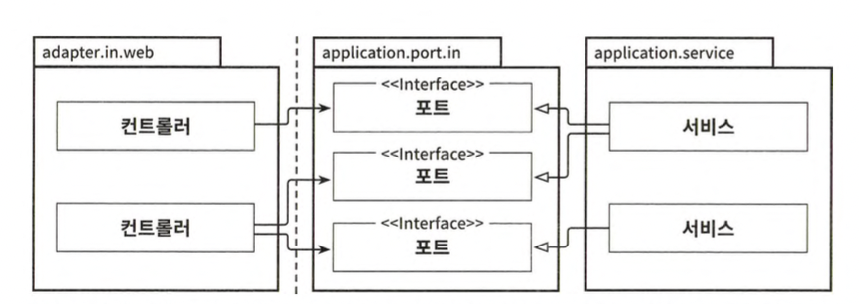

# 웹 어댑터
오늘날의 애플리케이션은 대부분 웹 인터페이스 같은 것을 제공한다. 웹 브라우저를 통해 상 호작용할 수 있는 UI나 다른 시스템에서 우리 애플리케이션으로 호출하는 방식으로 상호작용하는 HTTP API가 여기에 해당한다.

우리가 목표로 하는 아키텍처에서 외부 세계와의 모든 커뮤니케이션은 어댑터를 통해 이뤄진다.



웹 어댑터는 ‘주도하는’ 혹은 ‘인커밍’ 어댑터다. 외부로부터 요청을 받아 애플리케이션 코 어를 호출하고 무슨 일을 해야 할지 알려준다. <br>
이때 제어 흐름은 웹 어댑터에 있는 컨트 롤러에서 애플리케이션 계층에 있는 서비스로 흐른다.

애플리케이션 계층은 웹 어댑터가 통신할 수 있는 특정 포트를 제공한다. 서비스는 이 포트를 구현하고, 웹 어댑터는 이 포트를 호출할 수 있다.

왜 어댑터와 유스케이스 사이에 또 다른 간접 계층을 넣어야 할까? <br>
애플리케이션 코어가 외부 세계와 통신할 수 있는 곳에 대한 명세가 포트이기 때문이다. <br>
포트를 적절한 곳에 위치시키면 외부와 어떤 통신이 일어나고 있는지 정확히 알 수 있고, 이는 레거시 코드를 다루는 유지보수 엔지니어에게는 무척 소중한 정보다.

## 웹 어댑터의 책임

웹 어댑터는 일반적으로 다음과 같은 일을 한다.

1. HTTP 요청을 자바 객체로 매핑
2. 권한 검사
3. 입력 유효성 검증
4. 입력을 유스케이스의 입력 모델로 매핑
5. 유스케이스 호출
6. 유스케이스의 출력을 HTTP로 매핑
7. HTTP 응답을 반환

우선 웹 어댑터는 URL, 경로, HTTP 메서드, 콘텐츠 타입과 같이 특정 기준을 만족하는 HTTP 요청을 수신해야 한다. 그러고 나서 HTTP 요청의 파라미터와 콘텐츠를 객체로 역직렬화해야 한다. <br>
보통은 웹 어댑터가 인증과 권한 부여를 수행하고 실패할 경우 에러를 반환한다.

그러고 나면 들어오는 객체의 상태 유효성 검증을 할 수 있다. <br>
그런데 앞에서 입력 유효 성 검증이 유스케이스 입력 모델의 책임이라고 이야기했다. <br>
유스케이스 입력 모델은 유스케이스의 맥락에서 유효한 입력만 허용해야 한다. 그러나 여기서는 웹 어댑터 의 입력 모델에 대해 이야기하고 있는 것이다. <br>
유스케이스의 입력 모델과는 구조나 의미가 완전히 다를 수 있으므로 또 다른 유효성 검증을 수행해야 한다. <br>
**웹 어댑터의 입력 모델을 유스케이스의 입력 모델로 변환할 수 있다는 것을 검증해야 한다.**

## 컨트롤러 나누기

각 컨트롤러가 가능한 한 좁고 다른 컨트롤러와 가능한 한 적게 공유하는 웹 어댑터 조각을 구현 해야한다.

```java
@RestController
@RequiredArgsConstructor 
class AccountController {
    private final GetAccountBalanceQuery getAccountBalanceQuery;
    private final ListAccountsQuery listAccountsQuery;
    private final LoadAccountQuery loadAccountQuery;

    private final SendMoneyUseCase sendMoneyUseCase;
    private final CreateAccountUseCase createAccountUseCase;


    @GetMapping("/accounts")
    List<AccountResource> listAccounts(){
        // ...
    }

    @GetMapping("/accounts/{accountId}")
    AccountResource getAccount(@PathVariable("accountId") Long accountId){
        // ...
    }

    @GetMapping("/accounts/{accountId}/balance")
    long getAccountBalance(@PathVariable("accountId") Long accountId){
        // ...
    }

    @PostMapping("/accounts")
    AccountResource createAccount(@RequestBody AccountResource account){
        // ...
    }

    @PostMapping("/accounts/send/{sourceAccountId}/{targetAccountId}/{amount}")
    void sendMoney(
        @PathVariable("sourceAccountId") Long sourceAccountId,
        @PathVariable("targetAccountId") Long targetAccountId,
        @PathVariable("amount") Long amount
    ) {
        // ...
    }
}
```

계좌 리소스와 관련된 모든 것이 하나의 클래스에 모여 있으며 괜찮아 보인다. 하지만 이 방식의 단점을 한번 살펴보자. 

먼저, 클래스마다 코드는 적을수록 좋다. <br>
시간이 지나면서 컨트롤러에 200줄만 늘어나도 50줄을 파악하는 것에 비해 난이도가 높 아진다. 아무리 메서드로 깔끔하게 분리돼 있어도 쉽지 않은 일이다.

하지만 이것만큼 중요한 또 다른 점은 모든 연산을 단일 컨트롤러에 넣는 것이 데이터 구조의 재활용을 촉진한다는 데 있다. <br>
앞의 예제 코드에서 많은 연산들이 AccountResource 모델 클래스를 공유한다.

```java
@RestController
@RequiredArgsConstructor
public class SendMoneyController {
    private final SendMoneyUseCase sendMoneyUseCase;

    @PostMapping("/accounts/send/{sourceAccountId}/{targetAccountId}/{amount}")
    void sendMoney(
        @PathVariable("sourceAccountId") Long sourceAccountId,
        @PathVariable("targetAccountId") Long targetAccountId,
        @PathVariable("amount") Long amount
    ) {
        SendMoneyCommand command = new SendMoneyCommand(
            new Accountld(sourceAccountId),
            new Accountld(targetAccountId),
            Money.of(amount));

        SendMoneyUseCase.sendMoney(command);
    }
}
```


