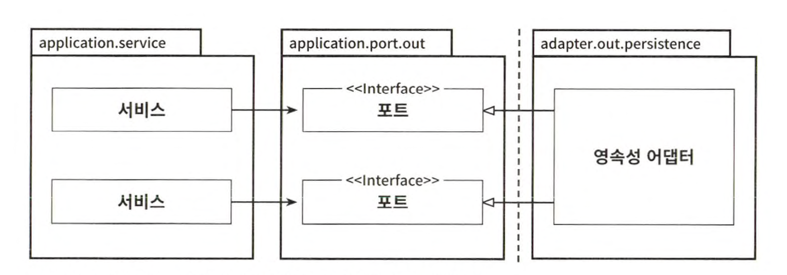
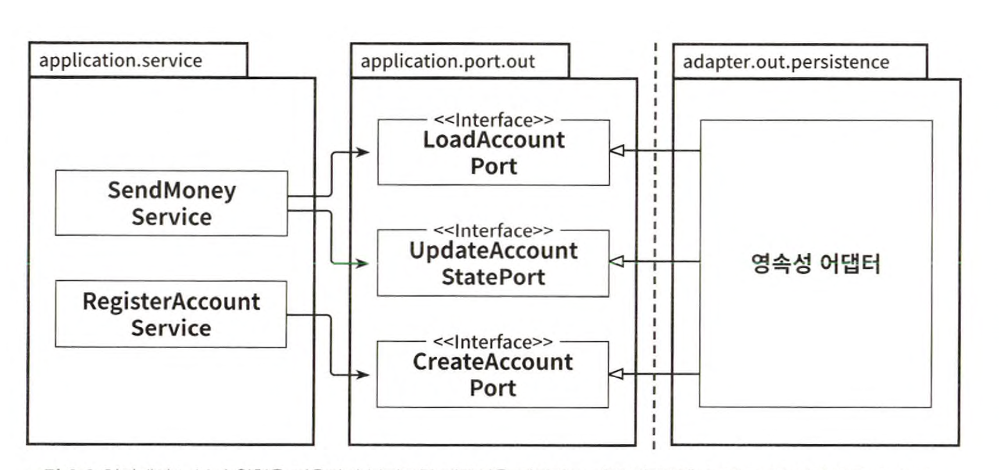

# 영속성 어댑터



애플리케이션 서비스에서는 영속성 기능을 사용하기 위해 포트 인터페이스를 호출한다. <br>
이 포트는 실제로 영속성 작업을 수행하고 데이터베이스와 통신할 책임을 가진 영속성 어댑터 클래스에 의해 구현된다.

포트는 사실상 애플리케이션 서비스와 영속성 코드 사이의 간접적인 계층이다. <br>
영속성 계층에 대한 코드 의존 성을 없애기 위해 이러한 간접 계층을 추가하고 있다는 사실을 잊지 말자. <br>
이렇게 되면 영속성 코드를 리팩터링하더라도 코어 코드를 변경하는 결과로 이어지지 않을 것이다.

## 영속성 어댑터의 책임

1. 입력을 받는다
2. 입력을 데이터베이스 포맷으로 매핑한다
3. 입력을 데이터베이스로 보낸다
4. 데이터베이스 출력을 애플리케이션 포맷으로 매핑한다
5. 출력을 반환한다

영속성 어댑터는 포트 인터페이스를 통해 입력을 받는다. 입력 모델은 인터페이스가 지정한 도메인 엔티티나 특정 데이터베이스 연산 전용 객체가 될 것이다.


## 포트 인터페이스 나누기


특정 엔티티가 필요로 하는 모든 데이터베이스 연산을 하나의 리포지토리 인터페이스에 넣어 두는 게 일반적인 방법이다. <br>
그럼 데이터베이스 연산에 의존하는 각 서비스는 인터페이스에서 단 하나의 메서드만 사용하더라도 하나의 넓은 포트 인터페이스에 의존성을 갖게 된다. 코드에 불필요한 의존성이 생겼다는 뜻이다.

인터페이스 분리 원칙은 이 문제의 딥을 제시한다. <br>
이 원칙은 클라이언트가 오로지 자신이 필요로 하는 메서드만 알면 되도록 넓은 인터 페이스를 특화된 인터페이스로 분리해야 한다고 설명한다.



##  스프링 데이터 JPA 예제

AccountPersistenceAdapter를 구현한 코드를 살펴보자. <br>
이 어댑터는 데이터베이스로부터 계좌를 가져오거나 저장할 수 있어야 한다.

```java
@AllArgsConstructor(access = AccessLevel.PRIVATE) 
public class Account {
    @Getter private final Accountld id;
    @Getter private final Activitywindow activitywindow;
    private final Money baselineBalance;

    public static Account withoutId(
        Money baselineBalance,
        Activitywindow activitywindow
    ) {
        return new Account(null, baselineBalance, activitywindow);
    }

    public static Account withId(
        Accountld accountId,
        Money baselineBalance,
        Activitywindow activitywindow
    ) {
        return new Account(accountld, baselineBalance, activitywindow);
    }

    public Money calculateBalance() { 
        // ...
    }

    public boolean withdraw(Money money, Accountld targetAccountId) {
        // ...
    }
    public boolean deposit(Money money, Accountld sourceAccountId) { 
        // ...
    }
}
```

Account 클래스는 getter와 setter만 가진 간단한 데이터 클래스가 아니며 최대한 불변성 을 유지하려 한다는 사실을 상기하자. <br>
유효한 상태의 Account 엔티티만 생성할 수 있는 팩터리 메서드를 제공하고 출금 전에 계좌의 잔고를 확인하는 일과 같은 유효성 검증을 모든 상태 변경 메서드에서 수행하기 때문에 유효하지 않은 도메인 모델을 생성할 수 없다.

데이터베이스와의 통신에 스프링 데이터 JPA를 사용할 것이므로 계좌의 데이터베이스 상태를 표현하는 @Entity 애너테이션이 추가된 클래스도 필요하다. 

```java
@Entity
@Table(name = "account") 
@Data
@AllArgsConstructor
@NoArgsConstructor
class AccountJpaEntity {
    @Id 
    @GeneratedValue
    private Long id;
    
    
}
```

```java
@Entity
@Table(name = "activity") 
@Data
@AllArgsConstructor
@NoArgsConstructor
class ActivityJpaEntity {
    @Id 
    @GeneratedValue
    private Long id;

    @Column private LocalDateTime timestamp;
    @Column private Long ownerAccountId;
    @Column private Long sourceAccountId;
    @Column private Long targetAccountId;
    @Column private Long amount;
}
```

다음으로 기본적인 CRUD 기능과 데이터베이스에서 활동들을 로드하기 위한 커스텀 쿼리를 제공하는 리포지토리 인터페이스를 생성하기 위해 스프링 데이터를 사용 한다.

```java
interface AccountRepository extends JpaRepository<AccountJpaEntity, Long> { 
    
}
```

```java
interface ActivityRepository extends JpaRepository<ActivityJpaEntity, Long> {
    @Query("select a from ActivityJpaEntity a " +
        "where a.ownerAccountId = :ownerAccountId " +
        "and a.timestamp >= :since")
    List<ActivityJpaEntity> findByOwnerSince( @Param("ownerAccountId") Long ownerAccountId, @Param("since") LocalDateTime since);
    
    // ...
    // ...
}
```

이제 JPA 엔티티와 리포지토리를 만들었으니 영속성 기능을 제공하는 영속성 어댑터를 구현해보자.

```java
@RequiredArgsConstructor
@Component
class AccountPersistenceAdapter implements LoadAccountPort, UpdateAccountStatePort {
    private final AccountRepository accountRepository;
    private final ActivityRepository activityRepository;
    private final AccountMapper accountMapper;
    
    @Override
    public Account loadAccount(Accountld accountId, LocalDateTime baselineDate) {
        AccountJpaEntity account = accountRepository.findById(accountId.getValue())
            .orElseThrow(EntityNotFoundException::new);

        List<ActivityJpaEntity> activities = activityRepository.findByOwnerSince(accountId.getValue(), baselineDate);
        
        // ...

        return accountMapper.mapToDomainEntity(account, activities, withdrawalBalance, depositBalance);
    }
}
```

## 데이터베이스 트랜잭션은 어떻게 해야 할까 ?

트랜잭션은 하나의 특정한 유스케이스에 대해서 일어나는 모든 쓰기 작업에 걸쳐 있어야 한다. 그래야 그중 하나라도 실패할 경우 다 같이 롤백될 수 있기 때문이다. <br>
영속성 어댑터는 어떤 데이터베이스 연산이 같은 유스케이스에 포함되는지 알지 못하기 때문에 언제 트랜잭션을 열고닫을지 결정할수 없다. 이 책임은 영속성 어댑터 호출을 관장하는 서비스에 위임해야 한다.

자바와 스프링에서 가장 쉬운 방법은 @Transactional 애너테이션을 애플리케이션 서비스 클래스에 붙여서 스프링이 모든 public 메서드를 트랜잭션으로 감싸게 하는 것이다.

```java
@Transactional
public class SendMoneyService implements SendMoneyllseCase {
    
}
```


